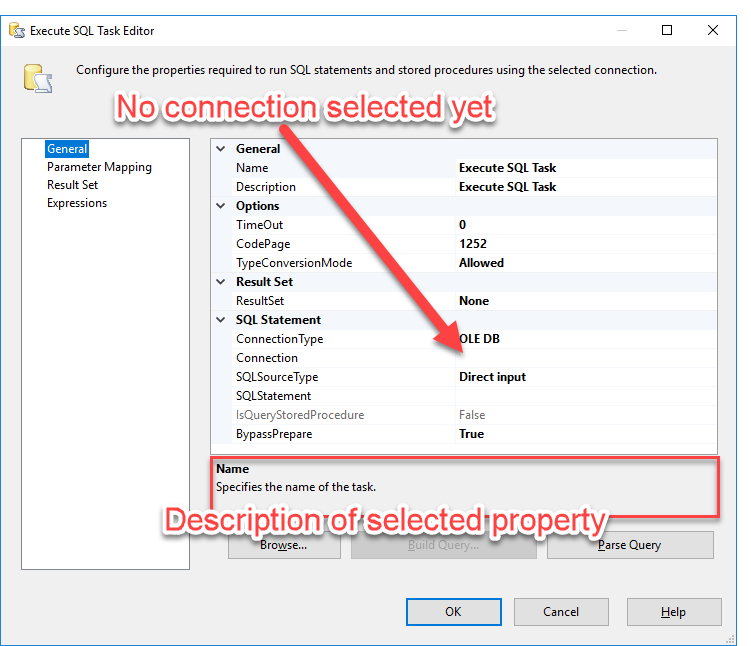
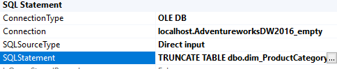

# Lab 1 - Exercise 2

## Description
In lab 1, you will create a first SSIS package. In this exercise, you will create some Control Flow logic to make the package repeatable.

## Steps

### Open solution
1. Open solution "Lab 1 Exercise 2 start" from the "Start" folder (or continue where you left off after exercise 1)

Although we already verified that the package "Load_dimProductCategory.dtsx" worked in exercise 1, we also saw that:

* Columns "SpanishProductCategoryName"  and "FrenchProductCategoryName" were empty
* The package always adds all rows available in source, regardless what data is already in `Dim_ProductCategory`.

In this exercise, we will add a control flow task to truncate the table DimProductCategory prior to loading the rows - effectively a "refresh" operation.

### Add a Control Flow task to empty a table before loading it

2. *Open Load_dimProductCategory.dtsx* (if not already opened)
3. Switch to the Control Flow
4. Add an *"Execute SQL Task"* by dragging the corresponding task from the *SSIS Toolbox* to the *Control Flow Canvas*.

The task will show up bearing a red cross, indicating that it won't work currently.

5. *Open* the *"Execute SQL Task"* by double-clicking on it.

Under the "SQL Statement" property group, notice that:
* An "OLE DB" ConnectionType has been selected. This is the type of connection we currently use for all our SQL Server connections in this package
* currently no connection manager has been selected.
* A SQLSourceType of "Direct input" has been selected. This means basically that you can enter a SQL query inside the next property, which will be executed using the task
* SQLStatement is empty
When you click on any property, a description is shown in the grey box below the property list.

6. Configure the task to use the "localhost.AdventureWorksDW2016_empty" connection manager. You can do this by clicking in the empty box besides "Connection", click the dropdown arrow and select "localhost.AdventureWorksDW2016_empty"

7. Enter the SQL Statement `TRUNCATE TABLE dbo.dim_ProductCategory` inside the *"SQLStatement"* Property

8. Click "OK" to store all changes and close the window.
9. Rename the task to "SQL Truncate dim_ProductCategory"

### Finishing the Control flow

Before testing and executing this package, one more thing needs to be configured to make sure the you'll never end up with an empty table.
(Hint: in which order are the two tasks executed?)

10. Perform the necessary task to ensure that the two tasks are executed in order

## Review
* Although very straightforward, refreshing (truncate table followed by insert all rows) isn't something you see a lot when loading Data Warehouse dimensions. Can you imagine why?