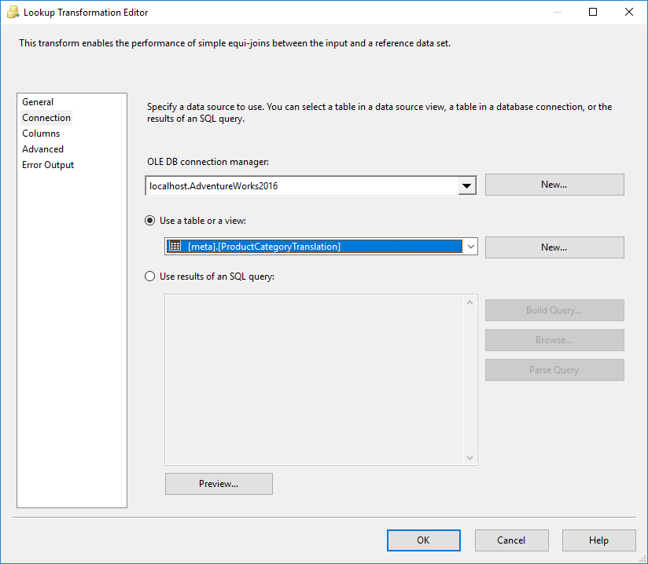
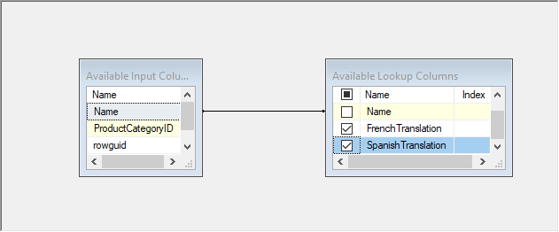
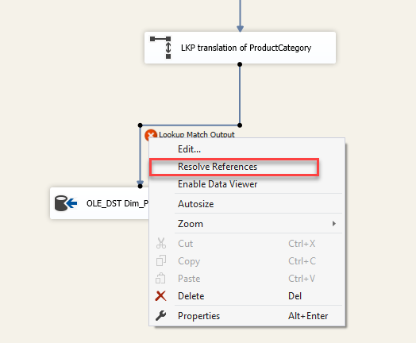
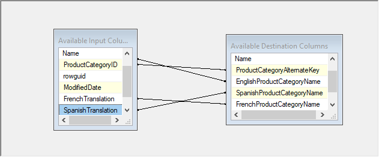

# Lab 2 - Exercise 1

## Description

In the previous exercise, we did some translations using a Derived Column transformation. 
This is a rather unusual way of looking up data, because you're storing values (this time the translated values) inside your logic (the SSIS package) - which means you can fix errors inside the data only by re-deploying your packages. Not something you should be fond of.

In this exercise, we will use a lookup table to perform the translations.

## Steps

1. Open the solution "Lab 02 Exercise 1" from the "Start" folder

### Create a lookup table inside the database, fill it with values

2. Open SQL Server Management Studio, connect to "localhost".
3. Execute the following script from the file "Query1 - create meta ProductCategoryTranslation.sql"

```SQL
USE AdventureWorks2016
GO

IF OBJECT_ID('meta.ProductCategoryTranslation', 'U') IS NOT NULL
    DROP TABLE meta.ProductCategoryTranslation;

GO
CREATE TABLE meta.ProductCategoryTranslation (
    [id] BIGINT IDENTITY(1,1)
    , [Name] NVARCHAR(50)
    , [FrenchTranslation] NVARCHAR(50)
    , [SpanishTranslation] NVARCHAR(50)
)
GO
INSERT INTO meta.ProductCategoryTranslation ([Name], [SpanishTranslation], [FrenchTranslation])
VALUES
('Bikes', 'Bicicleta', 'Vélo')
, ('Components', 'Componente', 'Composant')
, ('Clothing', 'Prenda', 'Vêtements')
, ('Accessories', 'Accesorio', 'Accessoire');
GO
```

### Alter the SSIS package to use the lookup table for translations

4. Switch to Visual Studio
5. Open the package "Load_dimProductCategory.dtsx"
6. Open "DFT Load dim_ProductCategory"
7. Delete "DER Translate ProductCategoryName"

Notice that this invalidates the data flow task.

8. Add a Lookup transformation
9. Drag the output from OLE_SRC Production ProductCategory towards the new lookup transformation
10. Open the Lookup transformation
11. Open the "Connection" page
12. Ensure that the AdventureWorks2016 connection manager has been selected
13. Select table `[meta].[ProductCategoryTranslation]`



14. Open the "Columns" page
15. Drag the "Name"  column from the input to the "Name" column from the lookup table.
16. Add checkboxes to FrenchTranslation and SpanishTranslation



17. Click "OK"
18. Rename "Lookup" to "LKP translation of productcategory"
19. Drag the output flow from "LKP translation of productcategory" towards "OLE_DST Dim_ProductCategory"
20. Choose "Lookup Match Output"

Notice the red cross besides "Lookup Match Output"

21. Right-click the red cross and choose "Resolve references"


22. Select "Delete Unmapped Input Columns"
23. Click "OK"
24. Open "OLE_DST Dim_ProductCategory"
25. Switch to the "Mappings" page
26. Map the input columns for French and Spanish translations 



27. Click "OK"

## Test

28. Re-run the package and validate the outcome using SQL Server Management Studio

## Next steps

This is the end of lab 02. [Lab 03](../lab03/Lab%203%20-%20challenge%20day%201.md) is the challenge for this day!
