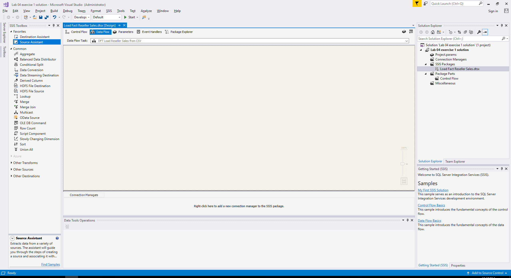
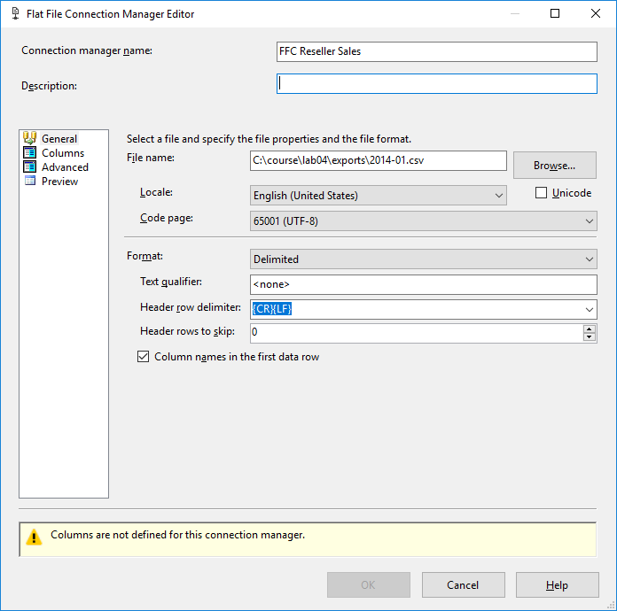

# Lab 4 - Exercise 1

## Description
In addition to the data available in the database, our customer has some CSV files containing reseller sales data of 2014.
In order to load this data, we will iterate over all CSV files. 
However, before loading *all* CSV files (this will be the next lab), in this exercise we will  figure out how to load a single one of them

## Steps

### Prepare a new solution
1. Create a new solution called "lab 04".
2. Delete "Package.dtsx"
3. Add a new SSIS package, name it "Load Fact Reseller Sales"

### Add Data Flow for the CSV file
4. Add a Data Flow Task, rename it to "DFT Load Reseller Sales from CSV"
5. Open the Data Flow Task you just created

6. Using the Source Assistant, create a new Data Flow Source that points to `C:\course\lab04\exports\2014-01.csv`
8. Name the connection manager "FFC Reseller Sales"

9. Go to the "Columns" page to load metadata for the columns

10. Review the column datatypes on the "Advanced" page, make sure the following datatypes are set:

  * TotalDue: Decimal
  * SubTotal: Decimal
  * TaxAmt: Decimal
  * Freight: Decimal
  * ProductID: four-byte signed integer
  * StoreID: four-byte signed integer
  * TerritoryID: four-byte signed integer
  * OrderDate: Date

11. Click "OK" to create the connection manager and accompanying source

12. Rename the new Flat File Source to "FFS Reseller Sales"

13. Use Lookup transformations to look up the corresponding dimension keys for the fact table:

* LKP dim store key
  * Connection manager: new connection (server: devmachine, database AdventureWorksDW2016_empty)
  * Table or view: [dbo].[dim_Store]
  * Lookup via: StoreID -> StoreAlternateKey
  * Include "StoreKey" in output

* LKP dim product key
  * Connect Lookup Match output from LKP dim store key
  * Connection Manager: devmachine.AdventureworksDW2016_empty (has just been created)
  * Table or view: [dbo].[dim_Product]
  * Lookup: ProductID -> ProductAlternateKey
  * Include "ProductKey" in output

* LKP dim Salesterritory key
  * Connect Lookup Match output from LKP dim product key
  * Connection Manager: devmachine.AdventureworksDW2016_empty (has just been created)
  * Table or view: [dbo].[dim_SalesTerritory]
  * Lookup: TerritoryID -> SalesTerritoryAlternateKey
  * Include "SalesTerritoryKey" in output

14. Finally, add a destination so that all rows end up in dbo.fact_ResellerSales

## Test

15. Run the package and verify the results via SQL Server Management Studio