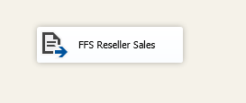

# Lab 4 - Exercise 1

## Description

In addition to the data available in the database, our customer has some CSV files containing reseller sales data of 2014.

In three steps, we are working towards an ETL package that can process all files in a folder:

* exercise 1 (current exercise): Create a static load package, to prove that the load logic works
* exercise 2: Make this package dynamic by using parameters, variables and expressions
* lab 5: Make the package loop across all files in the folder using a ForEach-loop

## Steps

### Prepare a new solution

1. Create a new solution called "lab 04".
2. Delete "Package.dtsx"
3. Add a new SSIS package, name it "Load Fact Reseller Sales"

### Add Data Flow for the CSV file

4. Add a Data Flow Task, rename it to "DFT Load Reseller Sales from CSV"
5. Open the Data Flow Task you just created

6. Using the Source Assistant, create a new Data Flow Source that points to `c:\Repos\ssis-training\lab04\exports\2014-01.csv`
7. Name the connection manager "FFC Reseller Sales"

8. Go to the "Columns" page to load metadata for the columns
9. Review the column datatypes on the "Advanced" page, make sure the following datatypes are set:
   * TotalDue: Numeric (this is the same as the T-SQL `DECIMAL` datatype)
   * SubTotal: Numeric
   * TaxAmt: Numeric
   * Freight: Numeric
   * ProductID: four-byte signed integer
   * StoreID: four-byte signed integer
   * TerritoryID: four-byte signed integer
   * OrderDate: Date

10. Click "OK" to create the connection manager and accompanying source
11. Rename the new Flat File Source to "FFS Reseller Sales"

12. Use Lookup transformations to look up the corresponding dimension keys for the fact table:
    * LKP dim store key
      * Connection manager: new connection (server: localhost, database AdventureWorksDW2016_empty)
      * Table or view: [dbo].[dim_Store]
      * Lookup via: StoreID -> StoreAlternateKey
      * Include "StoreKey" in output
    * LKP dim product key
      * Connect Lookup Match output from LKP dim store key
      * Connection Manager: localhost.AdventureworksDW2016_empty (has just been created)
      * Table or view: [dbo].[dim_Product]
      * Lookup: ProductID -> ProductAlternateKey
      * Include "ProductKey" in output
    * LKP dim Salesterritory key
      * Connect Lookup Match output from LKP dim product key
      * Connection Manager: localhost.AdventureworksDW2016_empty (has just been created)
      * Table or view: [dbo].[dim_SalesTerritory]
      * Lookup: TerritoryID -> SalesTerritoryAlternateKey
      * Include "SalesTerritoryKey" in output
13. Finally, add a destination so that all rows end up in dbo.fact_ResellerSales

## Test

14. Run the package and verify the results via SQL Server Management Studio

## Finish the package

15. Currently, the package always appends data. For test purposes, add a SQL Task before the Data Flow Task, containing the command `TRUNCATE TABLE dbo.fact_ResellerSales`. Rename the task to "SQL Truncate fact_ResellerSales".
