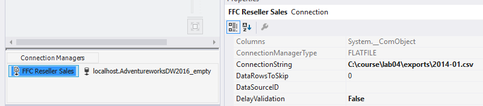
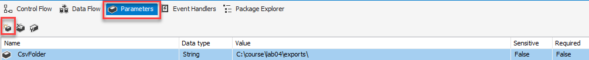
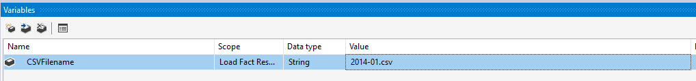
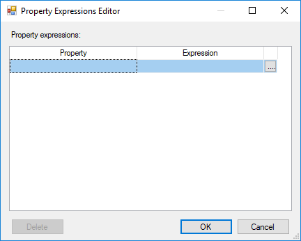
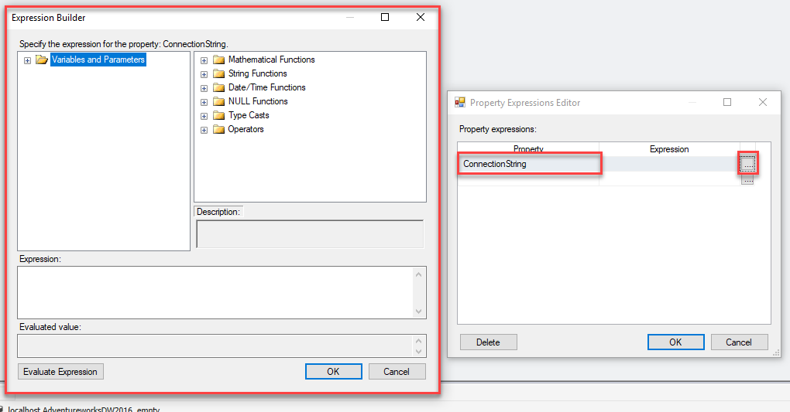
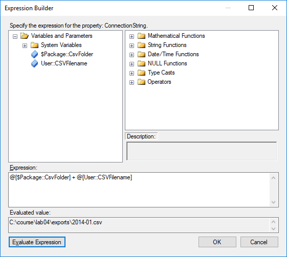

# Lab 4 - Exercise 2

## Description

In addition to the data available in the database, our customer has some CSV files containing reseller sales data of 2014.

In three steps, we are working towards an ETL package that can process all files in a folder:

* exercise 1: Create a static load package, to prove that the load logic works
* exercise 2 (current exercise): Make this package dynamic by using parameters, variables and expressions
* lab 5: Make the package loop across all files in the folder using a ForEach-loop

### Preparation

1. Open "Lab 04 exercise 2 start.sln" from the "start" folder
2. Open the package "Load Fact Reseller Sales.dtsx"

Currently, the package reads a CSV file with a fixed filename (`2014-01.csv`) from a fixed path (`c:\Repos\ssis-training\lab04\exports`).  
This is visible when you

3. click the connection manager, and
4. view the properties window by pressing `F4` on your keyboard (look for the property "ConnectionString")

It reads:  
`c:\Repos\ssis-training\lab04\exports\2014-01.csv`

In three steps, we will make the file that is read dynamic:

* We create a *parameter* that provides the path (currently `c:\Repos\ssis-training\lab04\exports\`)
* We create a *variable* providing the filename (currently `2014-01.csv`)
* We create an *expression* that replaces the ConnectionString of `FFC Reseller Sales` *each time the connection manager is called*.

### Create a parameter to provide the path

5. Switch to the Parameters tab
6. Click "Add Parameter" button
7. Provide the following details
   * Name: CsvFolder
   * Data type: String
   * Value: c:\Repos\ssis-training\lab04\exports\
   * Description: (think up a good description here)

  
### Create a variable for the filename

8. Switch back to the Control Flow tab
9. Right-click anywhere on the design canvas
10. Click "Variables" to open the variables pane (it opens up in the bottom)

Inside the variables pane (which is currently empty) all variables in the current context are listed.

11. Click "Add Variable"
12. Provide the following details
    * Name: CSVFilename
    * Data type: String
    * Value: 2014-01.csv

  

### Create an expression to fill the Connection String dynamically

13. Click on the Flat File Connection Manager
14. Press F4 on your keyboard to open the properties pane
15. Look for the property "Expressions". Click on it.
16. Click on the ellipsis (...) 

Now, the "Property Expressions Editor" opens. 

With this editor, you can provide expressions for all properties of an element, as long as they can be set dynamically at all.

17. In the "Property" column, select "ConnectionString"
18. In the "Expression"  column, click on the ellipsis

The Expression Builder opens.

Here, you have a small environment where you can see available variables and parameters, as well as several built-in functions in SSIS Expression Language.

19. Click on the plus sign before "Variables and Parameters"

Parameters are displayed like `$Package::` (or `$Project::`).
Variables are displayed like `User::`

20. Drag `$Package::CsvFolder` to the Expression textbox.
21. Click "Evaluate Expression" to inspect the parameter
22. At the end of the current expression, add  ` + ` ("space plus space")
23. Drag `User::CSVFileName` towards the end of the expression in the Expression textbox.
24. Click "Evaluate Expression" to see the outcome of current parameter and variable values

The expression should read `$Package::CsvFolder + User::CSVFileName`

25. Click "OK" to close the Expression Builder window
26. Click "OK" to close the Property Expression Editor window

## Test

27. Try running the package and inspect the outcome inside SSMS.
28. Try to alter the variable value manually to `2014-02` and validate the results in SSMS. See if different data is loaded indeed.