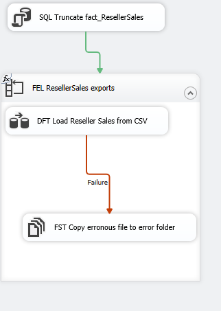

# Lab 6 Exercise 1

## Description

In lab 5, we developed an ETL package to load some extra sales data from CSV files.
However, apparently the data isn't always correct. How do we handle that in a good way?

In exercise 1 (current exercise) we will implement error handling inside the control flow
In exercise 2 we will extend the error handling using "error flows" inside a data flow

## Steps

### Getting ready

1. Open "Lab 06 Exercise 1 start.sln" from the "start" folder, or continue where you left off after finishing lab 05.
2. Open package "Load Fact Reseller Sales.dtx"
3. Switch to the parameters tab
4. Replace the value of `c:\Repos\ssis-training\lab05\exports\` with `c:\Repos\ssis-training\lab06\exports\`

As you can see, the package fails (at least, it should). Do you have any clue on what goes wrong?

We will tackle this issue in three steps:

* Catch errors inside the control flow. This way, unforseen errors can be handled graciously (current exercise)
* Identify erronous rows inside the data flow, so we can see what specifically goes wrong (exercise 2)
* Fix the error at the source: change the package logic, or get a better CSV file.

### Handling errors in the Control Flow

First we will add some error handling to handle unforseen error graciously. In this specific case we'll copy files with errors in a different folder.
To make clear where the file is moving, we will add a variable with the destination folder first.

5. Add a variable called "ErrorFolder"
   * Data type: string
   * Value: c:\Repos\ssis-training\lab06\exports\error
6. Provide the variable with an expression
5. Enlarge "FEL ResellerSales exports" somewhat by dragging the bottom corner down
6. Add a File System Task inside the FEL container
7. Configure the File System Task, so it will copy the file that's currently being processed the error folder.
8. Use a precedence constraint to ensure that this task will only be executed when the Data Flow Task fails
9. Rename the task to "FST Copy erronous file to error folder"

## Test

Execute the package again. Now, we can see which files caused errors inside the "error" subfolder (`c:\Repos\ssis-training\lab06\exports\error`).

## Configure the ErrorFolder variable so that it uses the parameterized path

Although the package works, the variable currently has its path fixed at `c:\Repos\ssis-training\lab06\exports\error`
This is unwanted behaviour: we provide a path inside the package parameter, so the package is expected to use the error subfolder inside the path.

10. Add an expression to the `ErrorFolder` variable so the error folder path will be constructed dynamically.

## Final touch (and bonus, if you like)

When you execute the package once more, another error wil happen: the file cannot be copied to the "error" subfolder, because a file with the same name already exists. Two ways to handle this:

* Basic scenario: Remove everything from the "error" folder before writing (or overwrite existing files). This is not a scenario you should strive for, because you lose knowledge about earlier executions.
* Desired scenario: Inside the "error" folder, create another subfolder specifically for every execution of the package. A common way to ensure a unique name for a given execution is to use the execution start date and time. You'll need three things to construct this name:
  * The system variable containing the execution start time & date (no, it's not `GETDATE()`)
  * An expression turning this variable into a usable string (you might want to use the interwebz for some sample expressions.. [For the date part](https://stackoverflow.com/questions/28458910/leading-zero-with-datestamp-in-ssis-expression), and for time [this one](https://docs.microsoft.com/en-us/sql/integration-services/expressions/datepart-ssis-expression))
  * A task creating the folder if it doesn't exist yet
  * (plus some logic to write erronuous files into this new folder)
  
11. Implement, depending on the amount of extra challenge you need, the basic or desired scenario.

## Next steps

Continue with [exercise 2](../Exercise%202/Lab%206%20Exercise%202.md)
