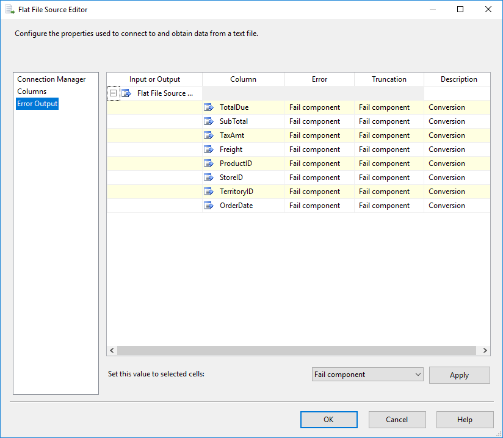
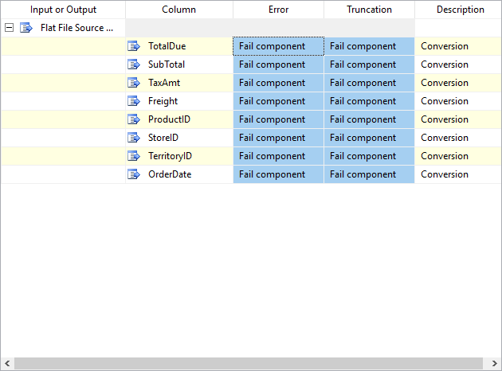
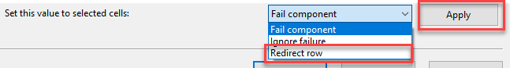
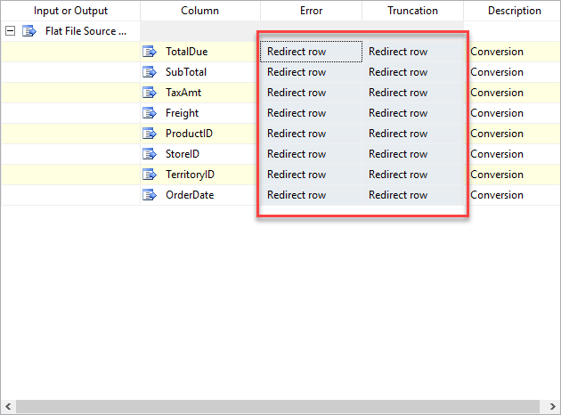
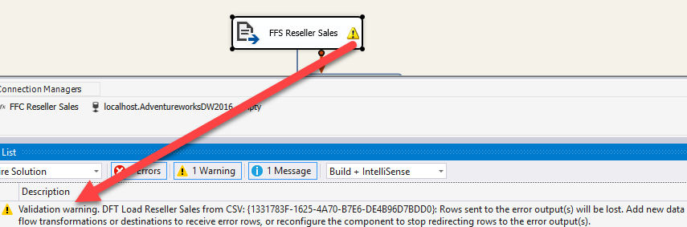
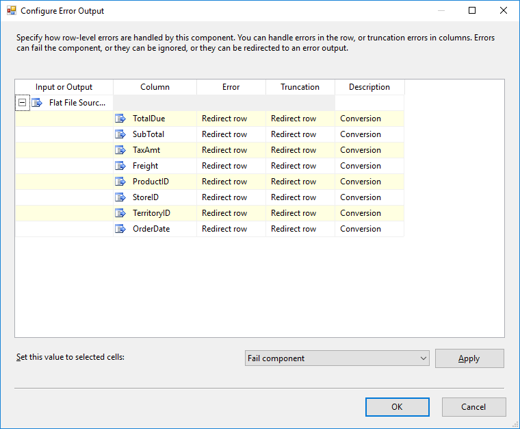
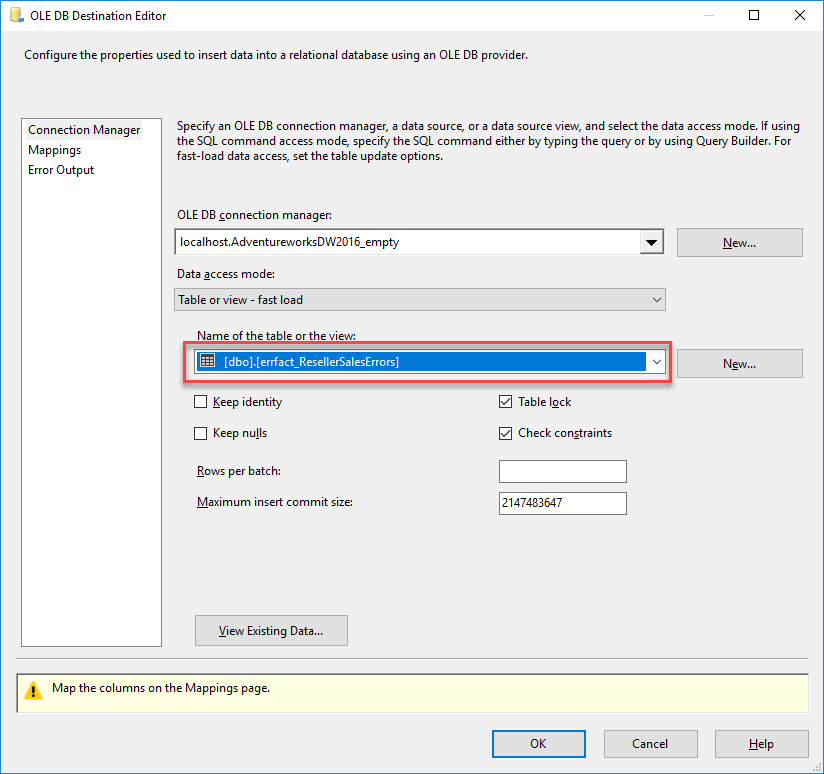

# Lab 6 Exercise 2

## Description

In lab 5, we developed an ETL package to load some extra sales data from CSV files.
However, apparently the data isn't always present. How do we handle that in a good way?

In exercise 1 we will implement error handling inside the control flow
In exercise 2 (current exercise) we will extend the error handling using "error flows" inside a data flow

## Steps

### Getting ready

1. Open "Lab 6 Exercise 2 start.sln" from the "start" folder. Depending on whether you completed the "bonus" assignment, the package might look a little different from the one you finished with in the previuos exercise.
2. Open package "Load Fact Reseller Sales.dtx"

### Identify the point at which errors occur in the Data Flow

In the previous exercise, we identified files containing errors: whenever the Data Flow failed, we would copy the file to an "error" folder.
In this exercise, we will look whether we can pinpoint the rows that cause errors.

3. Open DFT Load Reseller Sales from CSV by double-clicking on it.
4. Execute the package "Load Fact Reseller Sales". At what point does the error occur?

### Redirect error rows to a different output

5. Open the Flat File Source "FFS Reseller Sales"
6. Click on "Error Output" to open the Error Output page

Every element is currently set to **fail component** as soon as an error occurs.

7. Click on the cell "Fail component" in the "Error" column for the "TotalDue" element
8. Hold shift, then click on the "Fail component" in the "Truncation" for the "OrderDate" element

The selection now encompasses all fields set to "Fail component":

9. At the bottom of the window, the text "Set this value to selected cells" is displayed. Click the dropdown menu next to it.
10. Select "Redirect row", then click "Apply"

Now the all columns will be redirected when an error occurs, regardless whether it's a truncation or conversion error:

11. Click "OK" to apply the changes.

Notice that an exclamation mark appears on "FFS Reseller Sales" as soon as you click "OK". This is because all error rows will be redirected towards the error output, but the error output of "FFS Reseller Sales" is not connected to anything. Therefor, these rows will effectively be ignored:

### Add a sink for error rows

12. Use the Destination Assistant to create a new SQL Server destination. Use the existing "localhost.AdventureworksDW2016_empty" connection manager.
13. Connect the Error output from "FFS Reseller Sales" to the newly added "OLE DB Destination"

SSDT shows the "Configure Error Output" window for you to check if all redirects are set in the right way.

14. Click "OK"
15. Open the OLE DB Destination Editor by double-clicking on "OLE DB Destination".
16. In the OLE DB Destination Editor, select `dbo.errfact_ResellerSalesErrors` as the table to redirect the error rows into.

17. Open the "Mappings" page. The columns will be mapped automatically.
18. Click "OK"
19. Rename "OLE DB Destination" to "OLE_DST ErrFact"

## Test
20. Run the package "Load Fact Reseller Sales.dtsx"
21. Open SSMS, and select the rows inside `dbo.errfact_ResellerSalesErrors`. Can you see what goes wrong?

## Solving the problem

Apparently, the system who delivered our source data was misconfigured. The source system administrators promised to fix it.

* If you're running out of time, well be glad: the data has just arrived! Just re-configure the parameter so that the source folder "C:\course\lab06\exports" is replaced by "C:\course\lab06\export2".
* If you need some extra challenge, here it is: the data hasn't arrived yet, but the data is needed ASAP. Luckily, the adminstrators pointed out that you can find out which file is different by looking at the suffix "nl". Here's your challenge:
  * Add a second data flow which handles the "_nl" files correctly
  * Configure the precedence constraints with expressions, so that:
  * files without the "nl" suffix will be processed by the original data flow
  * files with the "nl" suffix will be processed by the alternative data flow

Looking for even more challenge? You can tidy the just-created solution up by splitting up the files in different folders *before* loading them:

* files with the "nl" suffix get into "folder1"
* files without the "nl"  suffix get into "folder2" (you're encouraged to use an even more meaningful names for the folders)
  
After that, create two separate ForEach loops, each with their own data flow.
This removes the complexity of expressions inside precedence constraints.
 