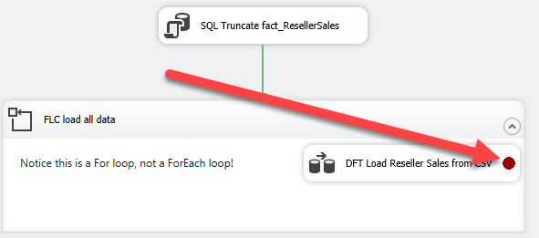
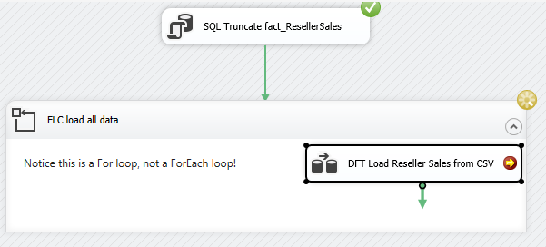
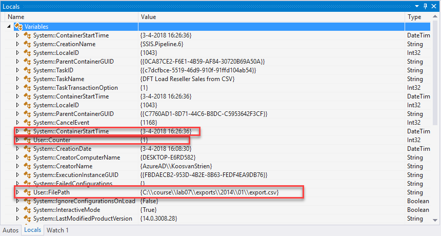
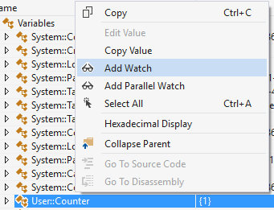
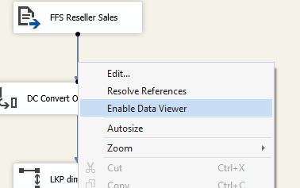
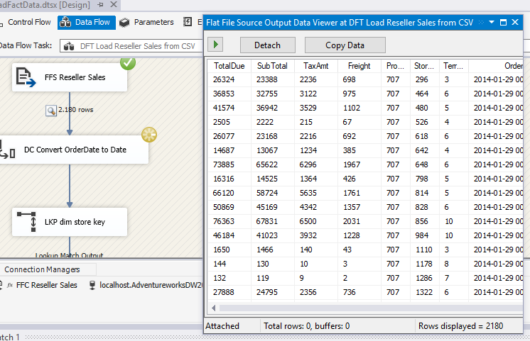

# Lab 7 Exercise 1

## Description
Inside lab 6, we explored how to do error handling inside SSIS.
In this lab, we'll explore how to debug using the IDE.

### Preparation
1. Open the solution "Lab 7 Exercise 1" from the "start" folder.
2. Open the package "LoadFactData.dtsx"
3. Execute the package

As you see, again something goes wrong when reading in files. 

### Debug the Control Flow using breakpoints

4. Right-click "DFT Load Reseller Sales from CSV", choose "Edit breakpoints.."
5. Configure flow to break when the container receives the OnPreExecute event

You will see a breakpoint sign (a red dot) appear in the Data Flow Task

6. Execute the package, and wait until the package breakpoint is hit (it'll do so almost immediately). This is shown by a yellow arrow inside the red dot.

In the bottom of the screen, several panes will show up:

* Autos
* Locals
* Watch 1
* Call Stack
* Breakpoints
* Exception Settings
* Command Window
* Immediate Window

Although a lot of them are for general (Visual Studio) debugging purposes, especially the "Locals" pane comes in handy.

7. Open the "Locals" pane (make the pane somewhat larger so you can have a good view)
8. Open the "Variables" group inside the "Locals" pane.

Notice there's lots of interesting runtime information here:
* The current value of the user counter
* The current value of the filepath we try to read
* The container start time (we used that in the previous lab to determine the file path)

For now, we'd like to keep an eye on the counter. At which point does the error occur?

9. Right-click "User::Counter", and choose "Add watch"

The "Watch 1" pane opens, showing the variable you just added.

10. Switch back to "Locals" and add "User::FilePath" to the watch as well.
11. Click "Continue", and see the next breakpoint being hit (and notice the updated values are signaled in red)
12. Continue until the package aborts due to an error. Which path goes wrong?

We could of course build some logic to avoid this error, but for now we'll take a shortcut:

13. Stop the package execution.
14. Copy the missing folder from the "extra_export" folder to the "export" folder.

15. Execute the package again, breakpoints still enabled.
16. Step through execution, until it fails again.

This time, it will fail at iteration 5. However, this file is available - so the error must be within the file!

### Debug the Data Flow using Data Viewers
17. Disable the breakpoint 
18. Open "DFT Load Reseller Sales from CSV"
19. Execute the package again. We can see the package breaks at the Data Conversion.
20. Stop the package execution
21. Right-click on the arrow between "FFS Reseller Sales" and "DC Convert OrderDate to Date", and choose "Enable Data Viewer"

22. Start execution again. Package execution will break and the data viewer will pop up.

23. Click "continue" four times (we already know the error occurs in the fifth iteration)
24. Click "Copy data"
25. Paste the data in Excel. Can you see what goes wrong?

## Review

Although the error was in the source this time (which delivered plainly wrong data), it demonstrates the capabilities of debugging using the Data Viewer: being able to see what's happening inside the data flow.

Notice that the Data Viewer doesn't always contain all data: just like the Data Flow in its entirety, it buffers data in batches. So when processing very large batches, you might have to sift through several screens of data to find the error (at this point, it will soon make sense to redirect the error flow into another table or file)